# Image Stitching

Image stitching is the process of combining multiple images with overlapping fields of view to produce a single panoramic image. 

**For this example i will be stitching 2 images captured at close proximity**
These are the two image that i will be merging together
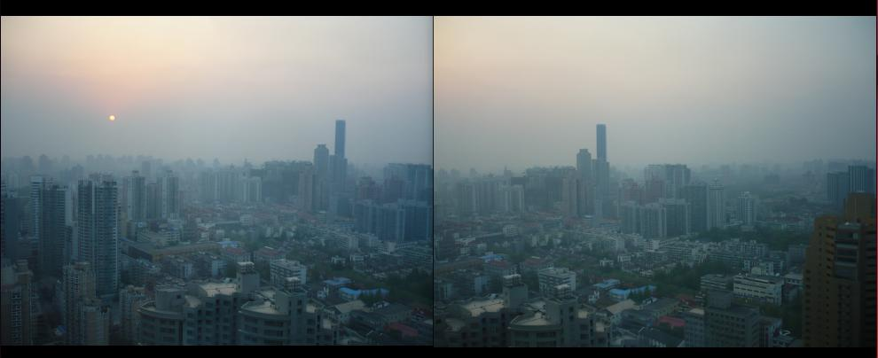

## Feature Identification

The first step in stitching image is feature detection.Its goal is to identify locate intriguing and recognizable focal areas in an image using feature detection algorithm.

For the purpose of detecting features, algorithms such as `SIFT (Scale-Invariant Feature Transform)`, `SURF (Speeded-Up Robust Features)`, and `ORB (Oriented FAST and Rotated BRIEF)` are frequently employed.
I have implemented `SURF` algorithm.

Below is the feature extracted from the two images:

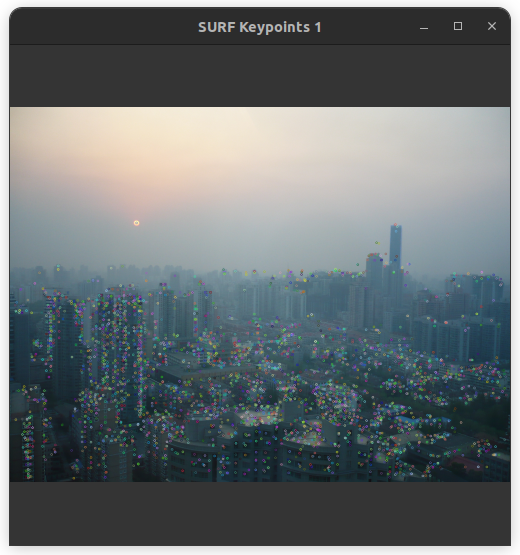

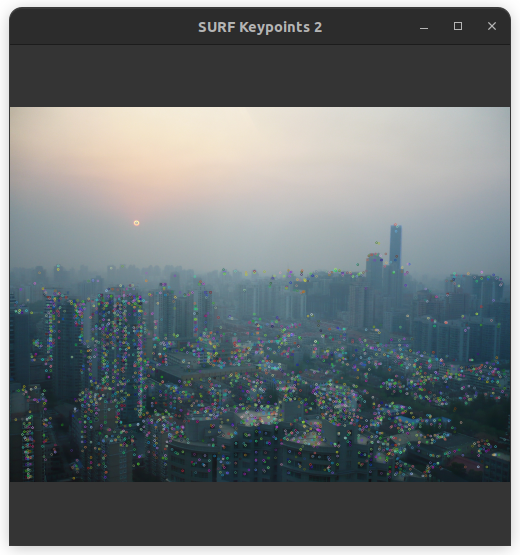


**We can find and plot the SURF Keypoints like this**
```c++
auto detector  = cv::xfeatures2d::SurfFeatureDetector::create();
detector->detectAndCompute(gray,noArray(),keypoints,descriptors); 
Mat img_keypoint;
drawKeypoints( img1, keypoints, img_keypoint); 
imshow("SURF Keypoints", img_keypoint); 
```

## Feature Extraction

The local picture data surrounding each keypoint is computed using the keypoint descriptors that have been identified.
The keypoints’ surrounding patches are numerically represented as descriptors, which encode their look or texture.Descriptors include details on the `neighborhood’s texture, color, and gradient characteristics`.

## Feature Matching

Now our task is to match the features between the two image. For that i have used brute force matcher
I have plotted only 50 points here for clear visualization. And since we are doing `brute force matching` to reduce the computational time, I have converted the image to grayscale.

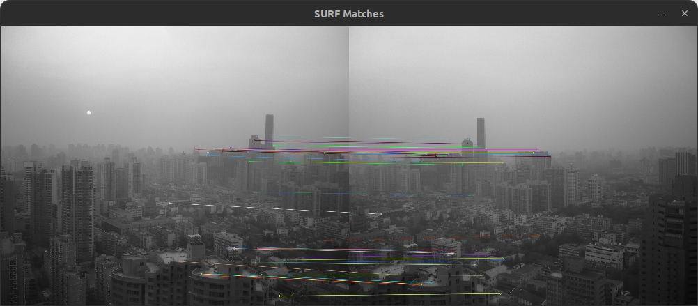

## HOMOGRAPHY 

It transforms image of one plane into another. Basically it projects image into another plane. The general matrix for homography is : 
```math
\begin{bmatrix}
h_{00} & h_{01} & ch_{02} \\
h_{10} & h_{11} & h_{12} \\
h_{20} & h_{21} & h_{22} \\
\end{bmatrix}
```

Image stitching occurs when different images are projected into one base image.

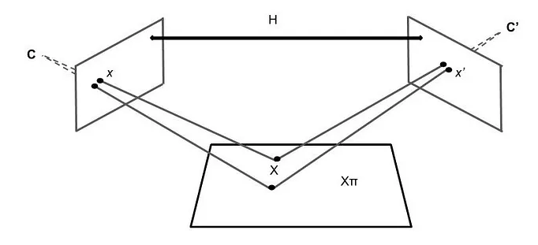

### Homography Computation


```math

\begin{bmatrix}
x_d \\
y_d  \\
1  \\
\end{bmatrix}
=
\begin{bmatrix}
x_d' \\
y_d'  \\
z_d'  \\
\end{bmatrix}

\mathbf{P} = 
\begin{bmatrix}
h_{11} & h_{12} & h_{13}\\
h_{21} & h_{22}  & h_{23}  \\
h_{31} & h_{32} & h_{33} \\
\end{bmatrix}

\begin{bmatrix}
x_s \\
y_s  \\
1  \\
\end{bmatrix}

```
There are `9 unknown and 8 degree of freedom`. Thus we need minimum of 4 matching points.

For a given pair i of corresponding point :

```math
x_{d}^{(i)} = \frac{h_{11}*x + h_{11}*y + h_{12}}{h_{31}*x + h_{32}*y + h_{33}}
\\
\;
\\
y_{d}^{(i)} = \frac{h_{21}*x + h_{22}*y + h_{23}}{h_{31}*x + h_{32}*y + h_{33}}
\\
\;
\\
\text{ Rearranging the terms : }
\\
x_{d}^{(i)} (h_{31}*x + h_{32}*y + h_{33}) = h_{11}*x + h_{11}*y + h_{12}
\\
y_{d}^{(i)} (h_{31}*x + h_{32}*y + h_{33}) = h_{21}*x + h_{22}*y + h_{23}
\\ \; \\
\text{On further arranging and putting in matrix format} 
\\

\begin{bmatrix}
x_s & y_s & 1 & 0 & 0 & 0 & -x_d * x_s & -x_d * y_s & -x_d \\
0 & 0 & 0 & x_s & y_s & 1 & -y_d * x_s & -y_d * y_s & -y_d  \\ 
\end{bmatrix}

\begin{bmatrix}
h_{11} \\
h_{12} \\
h_{13} \\
h_{21} \\
h_{22} \\
h_{23} \\
h_{31} \\
h_{32} \\ 
h_{33} \\
\end{bmatrix}

=

\begin{bmatrix}
0 \\
0 \\
\end{bmatrix}

```

Now Combining all the points we have :

```math

\begin{bmatrix}
x_s^{(i)} & y_s^{(i)} & 1 & 0 & 0 & 0 & -x_d^{(i)} * x_s^{(i)} & -x_d^{(i)} * y_s^{(i)} & -x_d^{(i)} \\
0 & 0 & 0 & x_s^{(i)} & y_s^{(i)} & 1 & -y_d^{(i)} * x_s^{(i)} & -y_d^{(i)} * y_s^{(i)} & -y_d^{(i)}  \\ 
... & ... & ... & ... & ... & ... & ... & ... & ... \\
x_s^{(n)} & y_s^{(n)} & 1 & 0 & 0 & 0 & -x_d^{(n)} * x_s^{(n)} & -x_d^{(n)} * y_s^{(n)} & -x_d^{(n)} \\
0 & 0 & 0 & x_s^{(n)} & y_s^{(n)} & 1 & -y_d^{(n)} * x_s^{(n)} & -y_d^{(n)} * y_s^{(n)} & -y_d^{(n)}  \\ 


\end{bmatrix}

\begin{bmatrix}
h_{11} \\
h_{12} \\
h_{13} \\
h_{21} \\
h_{22} \\
h_{23} \\
h_{31} \\
h_{32} \\ 
h_{33} \\
\end{bmatrix}

=

\begin{bmatrix}
0 \\
0 \\
\end{bmatrix}

\\
\text {The first matrix is the known matrix and using this matrix we have to find the homography parameter}
\\

\text { we solve it as :}
\\
Ah = 0 \text{ such that } ||h||^2 = 1
\\
\text{ Homography Matrix } = 

\text{Eigen Vector corresponding to smallest eigen value of }
(A^T .A)


```

For the above two images, the homography matrix is obtained as this

```math
\mathbf{Obtained Homography Matrix} = 
\begin{bmatrix}
4.02704e+23  & 1.91823 & 3.84908e-13\\
-2.12252e-05  &  1.36103  & 5.34602e+36 \\
6.08218e-36  &  0.672013  & -5.21667e+36 \\
\end{bmatrix}

```
 
# Warping
Once we obtain the homography matrix, we warp one of the image.

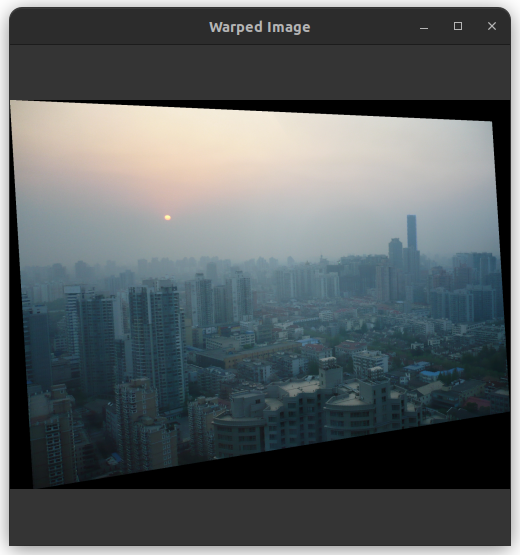

For warping we have to perform two process :
* **Forward Warp**
    In forward warp , we first transform the four corner of the original image. With this we can determine the size of the projected image.   
    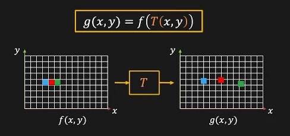


* **Backward Warp**
    Now we iterate over the image points and do backward warp and grab pixels from original image and fill the transformed image. For interpolation, i have taken pixel value of nearest rounded int pixel.  
     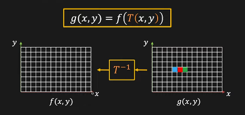

Now when we blend the image into the base image, the result will be as

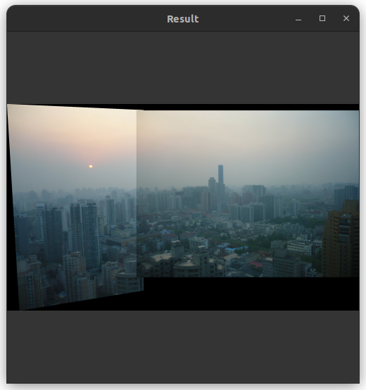

We can see there is a hard seam in the middle which occurs due to the difference in exposure and lightning condition during image capturing. We can tackle this problem with the help of reducing the pixel intensity value gradually towards edge and merging them.

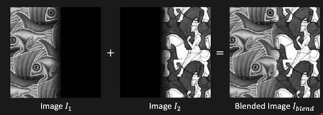

So we gradually decrease the intensity value near the border area of the each image where merging takes place.

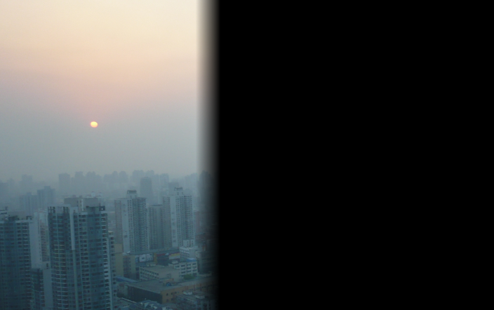
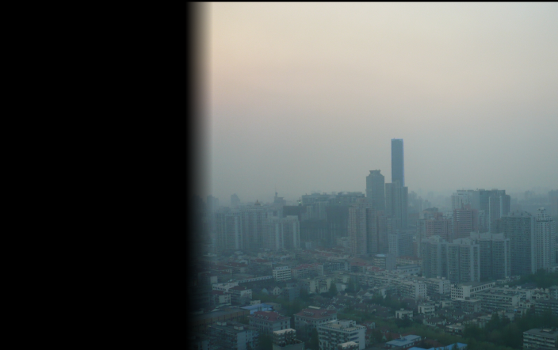

And when these two images are merged, we get
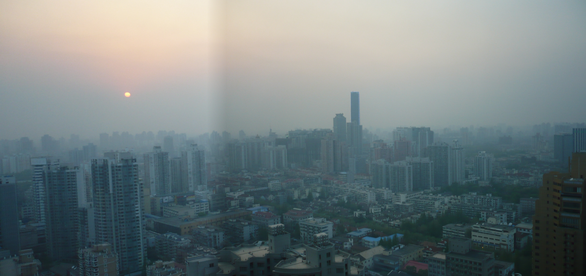

We can see the hard line vanishes, but due to extreme exposure differences a small crease is visible.

## References

* https://medium.com/@paulsonpremsingh7/image-stitching-using-opencv-a-step-by-step-tutorial-9214aa4255ec

* https://www.youtube.com/watch?v=J1DwQzab6Jg&list=PL2zRqk16wsdp8KbDfHKvPYNGF2L-zQASc


